```markdown
# Momenta.jl

[](https://dazhwu.github.io/Momenta.jl/dev/)
[](https://github.com/dazhwu/Momenta.jl/actions/workflows/CI.yml?query=branch%3Amain)
[](https://github.com/dazhwu/Momenta.jl/blob/main/LICENSE)


**Momenta** is a next-generation, high-performance library for **Panel Vector Autoregression (PVAR)** analysis.

It provides a rigorous implementation of the **Generalized Method of Moments (GMM)** estimators for dynamic panel data, strictly adhering to the econometric frameworks established by Holtz-Eakin et al. (1988), Arellano & Bover (1995), and Blundell & Bond (1998).

Functionally equivalent to (and significantly faster than) the R package `panelvar` (Sigmund & Ferstl, 2019) and Stata's `pvar` (Abrigo & Love, 2016), **Momenta** leverages Julia's Just-In-Time (JIT) compilation and native multi-threading to handle large-scale datasets and intensive bootstrapping procedures with unmatched efficiency.

> **For Python Users:** Access the full power of Momenta via our seamless wrapper: `pip install pymomenta`.

## Why Momenta?

While existing tools like R's `panelvar` or Stata's `xtabond2` are comprehensive, they often suffer from performance bottlenecks in large panels or during bootstrap inference. Momenta is built to supersede them.

### Performance Benchmarks

Momenta.jl is designed for speed. In benchmark tests involving System GMM estimation (100 iterations) and Bootstrap inference (1000 iterations), Momenta outperforms the R implementation (panelvar) by orders of magnitude.

**Table 1: Performance Comparison (fit)**

| Platform | Momenta (s) | Panelvar (R) (s) | Speedup |
| --- | --- | --- | --- |
| **Windows** | 3.0 | 621.2 | **207x** |
| **Ubuntu** | 2.1 | 523.4 | **249x** |
| **Mac OS** | 1.5 | 209.7 | **140x** |

**Table 2: Performance Comparison (bootstrap)**

| Platform | Momenta (s) | Panelvar (R) (s) | Speedup |
| --- | --- | --- | --- |
| **Windows** | 2.5 | 7510.8 | **3004x** |
| **Ubuntu** | 1.8 | 1756.1 | **975x** |
| **Mac OS** | 1.9 | 2609.9 | **1373x** |


#### Chart 1: Scenario A

```mermaid
%%{init: {'theme': 'base', 'themeVariables': { 'primaryColor': '#ffaa00', 'secondaryColor': '#ff0000', 'tertiaryColor': '#ffffff'}}}%%
xychart-beta
    title "Benchmark 1: Time Consumption (seconds) - Lower is Better"
    x-axis ["Windows", "Ubuntu", "Mac OS"]
    y-axis "Time (s)" 0 --> 700
    bar [3.0, 2.1, 1.5]
    bar [621.2, 523.4, 209.7]

```



*Legend: Series 1 (Left/Blue) = Momenta; Series 2 (Right/Green) = Panelvar (R)*

#### Chart 2: Scenario B (Huge Gap)

```mermaid
%%{init: {'theme': 'base'}}%%
xychart-beta
    title "Benchmark 2: Time Consumption (seconds) - Lower is Better"
    x-axis ["Windows", "Ubuntu", "Mac OS"]
    y-axis "Time (s)" 0 --> 8000
    bar [2.5, 1.8, 1.9]
    bar [7510.8, 1756.1, 2609.9]

```



*(Note: Performance benchmarks were executed on a MacBook Air M4 for macOS and an Intel i7-9700K for Ubuntu and Windows environments. To ensure a fair comparison, R and Julia implementations on Ubuntu and Windows utilized OpenBLAS optimization.)*


*Figure 1: Computation time (in seconds, log scale) for 200 bootstrap iterations across platforms.*

### Feature Comparison

| Feature | Momenta.jl | R (panelvar) | Stata (pvar) |
| --- | --- | --- | --- |
| **Core Engine** | **Julia (Compiled)** | R (Interpreted) | Stata (ADO) |
| **Parallelism** | **Native Multi-threading** | Limited | Limited |
| **Memory Efficiency** | **Zero-Copy Views** | High Overhead | Moderate |
| **GMM Estimators** | Diff & System GMM | Diff & System GMM | Diff GMM |
| **Transformation** | FD & FOD | FD & FOD | FD & FOD |
| **Python Support** | **Native Wrapper** | No | No |

## Key Features

### 1. Advanced GMM Estimation

* **System GMM**: Full implementation of the Blundell-Bond estimator, utilizing both level and difference equations for higher efficiency in persistent series.
* **Difference GMM**: Standard Arellano-Bond estimator.
* **Windmeijer Correction**: Finite-sample correction for standard errors (Windmeijer, 2005).

### 2. Rigorous Data Transformation

* **Forward Orthogonal Deviations (FOD)**: Implements the Arellano & Bover (1995) transformation, preserving sample size in unbalanced panels better than First Differences (FD).
* **Strict Listwise Deletion**: Unlike some implementations that introduce bias by retaining partial observations, Momenta enforces strict validity checks: if data is missing, corresponding instruments and regressors are correctly invalidated to preserve moment conditions.

### 3. Structural Analysis (PVAR)

* **Impulse Response Functions (IRF)**: Orthogonalized IRFs based on Cholesky decomposition.
* **Generalized IRF (GIRF)**: Order-invariant impulse responses (Pesaran & Shin, 1998).
* **Forecast Error Variance Decomposition (FEVD)**: Quantify the contribution of shocks to variable variability.
* **Fast Bootstrapping**: Multi-threaded bootstrapping for accurate confidence intervals in seconds, not minutes.

### 4. Specification Testing

* **Hansen J-Test**: For overidentifying restrictions.
* **Lag Selection**: Andrews-Lu MMSC criteria (MBIC, MAIC, MHQIC).
* **Stability Tests**: Eigenvalue checks for the companion matrix.

## Installation

### Julia

```julia
using Pkg
Pkg.add("Momenta")

```

### Python

```bash
pip install pymomenta

```

## Quick Start

### Julia Workflow

```julia
using Momenta, CSV, DataFrames

# 1. Load Data
df = CSV.read("dahlberg_data.csv", DataFrame)

# 2. Configure Model (Replicating Sigmund & Ferstl, 2019)
m = Momenta.fit(df, 
        ["id", "year"],  
        "n w  ~ lag(n, 1:2) lag(w, 1:2) k", 
        "GMM(n w, 2:4) IV(k)", 
        "fod" 
)

# 3. Structural Analysis
irf = Momenta.irf(m, 8)
bootstrap_result = Momenta.bootstrap(m, 8, 200)
all_plots = Momenta.plot_irf(m, bootstrap_result)

```

### Python Workflow

```python
import pandas as pd
from pymomenta import fit

df = pd.read_csv("dahlberg_data.csv")

# Estimate using the high-performance Julia backend
m = fit(df, 
        ["id", "year"],  
        "n w  ~ lag(n, 1:2) lag(w, 1:2) k", 
        "GMM(n w ,2:4) IV(k)", 
        "fod" 
)

```

## Methodology & References

Momenta is designed to strictly follow the theoretical foundations laid out in:

* **Sigmund, M., & Ferstl, R. (2019).** Panel Vector Autoregression in R with the Package panelvar. *The Quarterly Review of Economics and Finance*. (The methodology implemented here mirrors and extends this work).
* **Arellano, M., & Bover, O. (1995).** Another look at the instrumental variable estimation of error-components models. *Journal of Econometrics*.
* **Blundell, R., & Bond, S. (1998).** Initial conditions and moment restrictions in dynamic panel data models. *Journal of Econometrics*.
* **Roodman, D. (2009).** How to do xtabond2: An introduction to difference and system GMM in Stata. *The Stata Journal*.

## License

This project is licensed under the MIT License.


